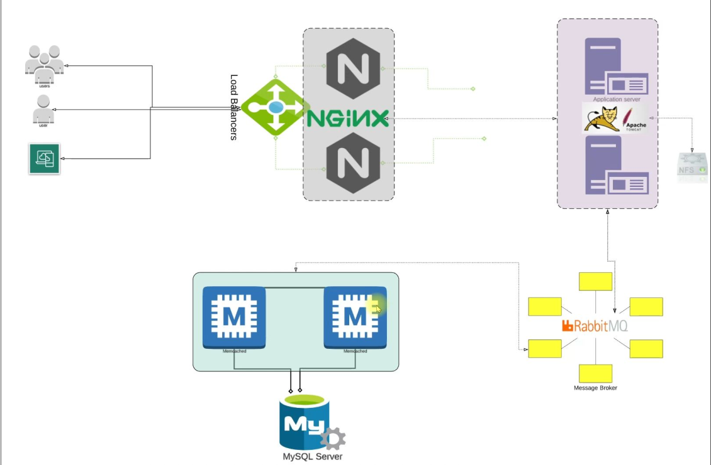
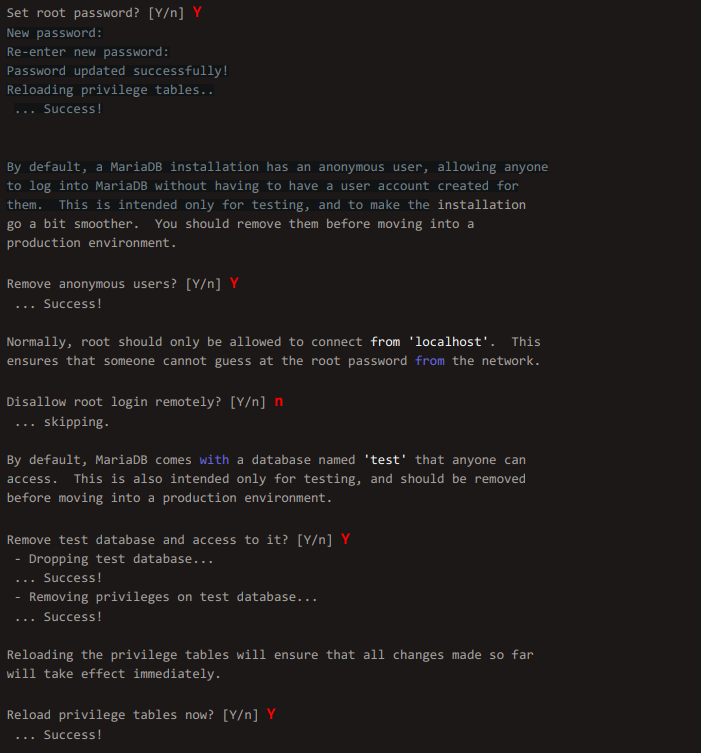
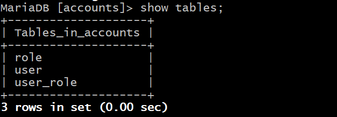
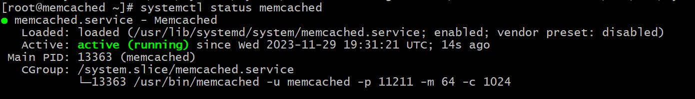
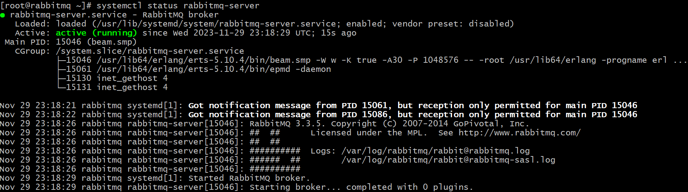
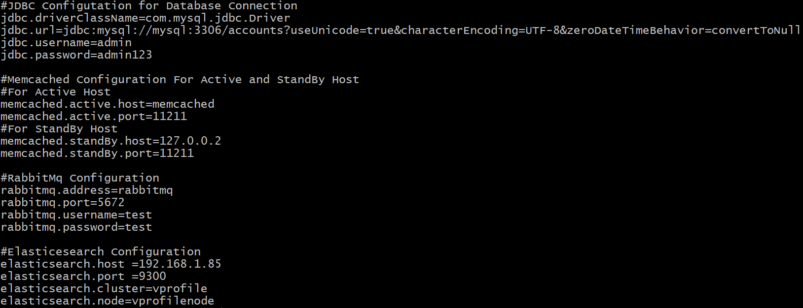
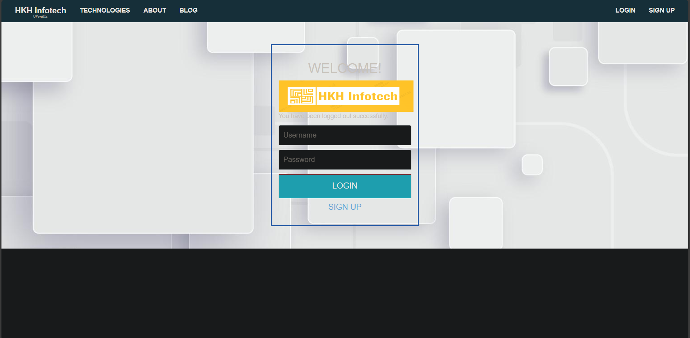
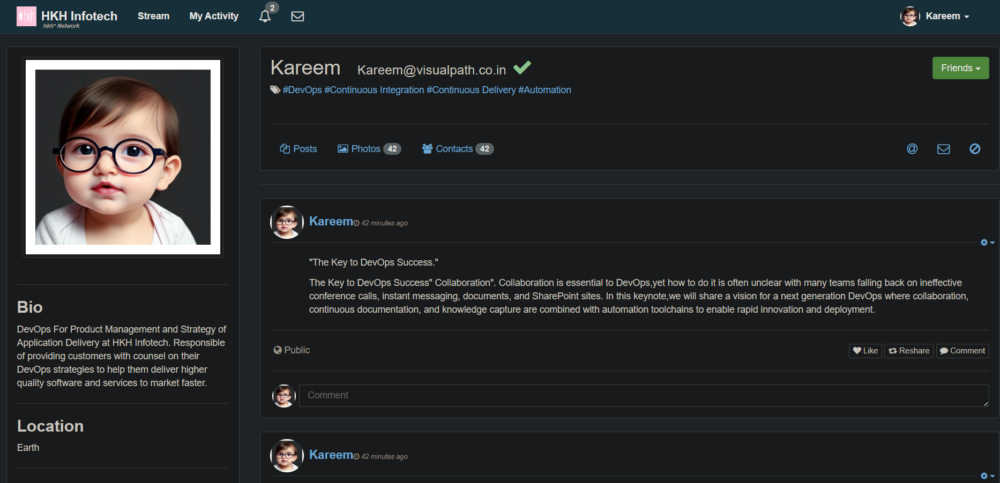

# Setting up a multi tier web application locally

In this project we will setup a five-service web application locally on 5 virtual machines which will be created using vagrant.



## Prerequisites:

- Oracle VM Virtualbox.
- Vagrant.
- Vagrant plugin (vagrant-hostmanager).
  ```
  vagrant plugin install vagrant-hostmanager
  ```
- Git bash or any equivalent terminal emulator.
- Minimum 3 GBs of RAM for the VMs.

## VM setup:

1. Clone the repository:

```
https://github.com/Kareem-Ataam/Vagrant-multi-tier-web-app.git
```

2. Get into the directory you cloned and then get into the directory called **_Manual-provisioning_** which contains the Vagrantfile that we will build the VMs from.
3. Issue the following command:

```
vagrant up
```

**_Note:_** It will take some time for vagrant to create the VMs and boot them up, but when they are created they will appear in Virtualbox in running state.

## Provisioning the services

We have five services to be provisioned which are:

- **_Nginx:_** Which will be used a load balancer.
- **_Tomcat:_** Application server.
- **_Memcached:_** Database caching service.
- **_RabbitMQ:_** Message Broker service.
- **_MySQL:_** The database service.

### Provisioning MySQL:

1. Connect to the VM running MySQL, in this case the VM called mysql_vm:

```
vagrant ssh mysql_vm
```

2. Open a terminal session as a root:

```
sudo -i
```

3. Update the OS packages:

```
yum update -y
```

4. Install the EPEL(Extra Packages for Enterprise Linux) repository, this repository contains additional packages that are not included in the default CentOS repositories:

```
yum install epel-release -y
```

5. Install the mariadb package and git:

```
yum install mariadb-server git -y
```

6. Start and enable the mariadb service:

```
systemctl start mariadb
systemctl enable mariadb
```

7. Run the following script which will guide you through the initial database configuration by asking questions and you provide the answers:

```
mysql_secure_installation
```

**_Hint_**: **mysql_secure_installation** is a tool provided with MariaDB (and MySQL) to help users secure their database installation by performing several important security-related tasks.

**_Note_**: I have used the password admin123 so you will find me using it in the following steps.

8. Login to the database:

```
mysql -u root -padmin123
```

9. Create a database and call it accounts:

```
create database accounts;
```

10. We will create a user called admin and give the user the privileges on all the database(accounts) objects through the following command:

```
grant all privileges on accounts.* TO 'admin'@'%' identified by 'admin123';
```

**_Hint_**: In 'admin'@'%' the "@'%'"means that the user can connect from any host.

11. Just refresh or reload the privileges:

```
FLUSH PRIVILEGES;
```

12. Exit from the database:

```
exit;
```

13. Clone the following repository and cd into it:

```
git clone -b main https://github.com/hkhcoder/vprofile-project.git
cd vprofile-project
```

14. We will build the the contents or the tables of the accounts database that we created before from the file that exist in the repo that we have just cloned:

```
mysql -u root -padmin123 accounts < src/main/resources/db_backup.sql
```

15. Log in to the database again and ensure that it has three tables which are **role, user, and user_role**:

```
mysql -u root -padmin123 accounts
show tables;
exit
```



16. Finally restart the service:

```
systemctl restart mariadb
```

### Provisioning Memcached:

1. Connect to the VM running MySQL, in this case the VM called memcached_vm:

```
vagrant ssh memcached_vm
```

2. Open a terminal session as a root:

```
sudo -i
```

3. Update the OS packages:

```
yum update -y
```

4. Install the EPEL(Extra Packages for Enterprise Linux) repository, this repository contains additional packages that are not included in the default CentOS repositories:

```
yum install epel-release -y
```

5. Install memcached, start and enable the service:

```
yum install memcached -y
systemctl start memcached
systemctl enable memcached
```

6. Check the status of the service:

```
systemctl status memcached
```

 7. In the file **/etc/sysconfig/memcached** we need to replace the loop back address (127.0.0.1) with 0.0.0.0 which allows the traffic from any source:

```
sed -i 's/127.0.0.1/0.0.0.0/g' /etc/sysconfig/memcached
```

8. Issue the following command so that memcached will run on port 11211 (TCP) and 11111 (UDP):

```
memcached -p 11211 -U 11111 -u memcached -d
```

9. Finally restart the service:

```
systemctl restart memcached
```

### Provisioning RabbitMQ:

1. Connect to the VM running MySQL, in this case the VM called rabbitmq_vm:

```
vagrant ssh rabbitmq_vm
```

2. Open a terminal session as a root:

```
sudo -i
```

3. Update the OS packages:

```
yum update -y
```

4. Install the EPEL(Extra Packages for Enterprise Linux) repository, this repository contains additional packages that are not included in the default CentOS repositories:

```
yum install epel-release -y
```

5. You need to install the packages of dnf at first as we will be using it to download the needed package for RabbitMQ:

```
yum install -y dnf
```

**_Hint:_** dnf stands for "Dandified Yum",it is the next-generation version of yum. 6. You can install RabbitMQ using the following commands:

```
dnf install -y rabbitmq-server
```

7. Start and enable the service:

```
systemctl start rabbitmq-server
systemctl enable rabbitmq-server
```

8. Check the status of the service:

```
systemctl status rabbitmq-server
```

 9. Configure RabbitMQ to allow connections from remote hosts not just from local machine (loopback):

```
sudo sh -c 'echo "[{rabbit, [{loopback_users, []}]}]." > /etc/rabbitmq/rabbitmq.config'
```

10. Add a user by rabbitMQ and give the user administration tag:

```
rabbitmqctl add_user test test
rabbitmqctl set_user_tags test administrator
```

11. Finally restart the service:

```
systemctl restart rabbitmq-server
```

### Provisioning Tomcat:

1. Connect to the VM running Tomcat, in this case the VM called tomcat_vm:

```
vagrant ssh tomcat_vm
```

2. Open a terminal session as a root:

```
sudo -i
```

3. Update the OS packages:

```
yum update -y
```

4. We need to install at first the dependencies ot tomcat:

```
yum install -y dnf & dnf -y install java-11-openjdk java-11-openjdk-devel
```

5. Install git, wget and maven:

```
dnf install git maven wget -y
```

6. Get into the tmp directory:

```
cd /tmp/
```

7. Download the tomcat package:

```
wget https://archive.apache.org/dist/tomcat/tomcat-9/v9.0.75/bin/apache-tomcat-9.0.75.tar.gz
```

8. Decompress and extract the package:

```
tar xzvf apache-tomcat-9.0.75.tar.gz
```

9. Add a user to the system called tomcat:

```
useradd --home -dir /usr/local/tomcat --shell /sbin/nologin tomcat
```

10. Copy the content of the directory apache-tomcat-9.0.75 into the home directory of the user tomcat:

```
cp -r /tmp/apache-tomcat-9.0.75/* /usr/local/tomcat/
```

11. Change the ownership of the directory tomcat to tomcat user:

```
chown -R tomcat.tomcat /usr/local/tomcat
```

12. Create a tomcat service file:

```
vi /etc/systemd/system/tomcat.service
```

13. Update the file with the content:

```
[Unit]
Description=Tomcat
After=network.target

[Service]
User=tomcat
WorkingDirectory=/usr/local/tomcat
Environment=JRE_HOME=/usr/lib/jvm/jre
Environment=JAVA_HOME=/usr/lib/jvm/jre
Environment=CATALINA_HOME=/usr/local/tomcat
Environment=CATALINE_BASE=/usr/local/tomcat
ExecStart=/usr/local/tomcat/bin/catalina.sh run
ExecStop=/usr/local/tomcat/bin/shutdown.sh
SyslogIdentifier=tomcat-%i

[Install]
WantedBy=multi-user.target
```

14. Reload the systemd service:

```
systemctl daemon-reload
```

15. Start and enable the tomcat service:

```
systemctl start tomcat
systemctl enable tomcat
```

#### Code Build and Deploy:

1. Clone the application code:

```
git clone -b main https://github.com/hkhcoder/vprofile-project.git
```

2. Update the **application.properties** file according to the names we give to the VMs and that appear when we see the content of the file /etc/hosts:

```
cd vprofile-project
vi src/main/resources/application.properties
```

 3. Build the artifact from the code (you should be inside the directory vprofile-project):

```
mvn install
```

4. Deploy the artifact:

```
systemctl stop tomcat
rm -rf /usr/local/tomcat/webapps/ROOT*
cp target/vprofile-v2.war /usr/local/tomcat/webapps/ROOT.war
systemctl start tomcat
chown tomcat.tomcat /usr/local/tomcat/webapps -R
systemctl restart tomcat
```

### Provisioning Nginx:

1. Connect to the VM running MySQL, in this case the VM called nginx_vm:

```
vagrant ssh nginx_vm
```

2. Open a terminal session as a root:

```
sudo -i
```

3. Update the OS packages:

```
apt update & apt upgrade
```

4. Install nginx:

```
apt install -y nginx
```

5. Create the nginx configuration file:

```
vi /etc/nginx/sites-available/vproapp
```

6. Update the file with the content:

```
upstream vproapp {
server tomcat:8080;
}
server {
listen 80;
location / {
proxy_pass http://vproapp;
}
}
```

7. Remove the default nginx config

```
rm -rf /etc/nginx/sites-enabled/default
```

8. Create a soft link:

```
ln -s /etc/nginx/sites-available/vproapp /etc/nginx/sites-enabled/vproapp
```

9. Restart nginx:

```
systemctl restart nginx
```

### Check if the application is running as intended:

1. In the browser write the IP of the nginx server which is http://192.168.32.6/ or anything else that you specified:



2. Complete all the sign-up details to check the database, then you will get the following UI:



## Done!! the app is up and running 🎉🎉🎉🎉🎉🎉🎉🎉🎉🎉🎉🎉🎉🎉
